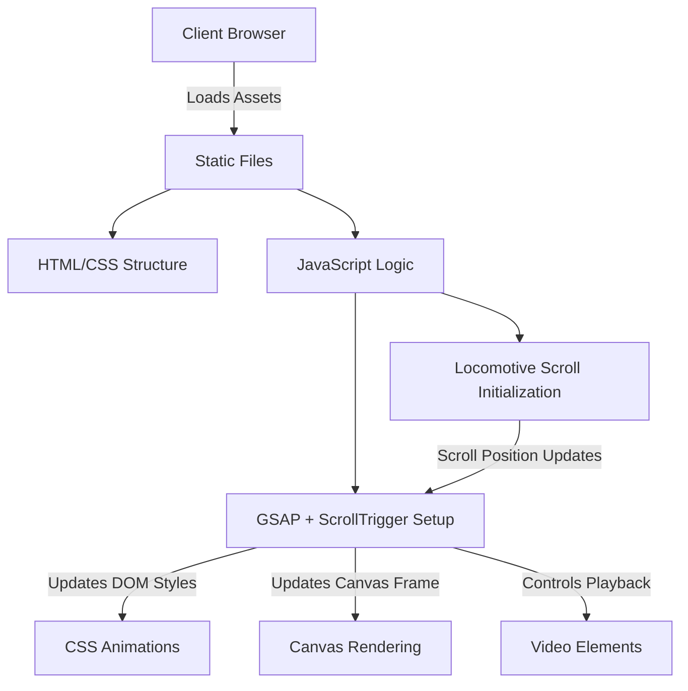

# Apple Vision Pro Website Clone

A stunning, interactive clone of the Apple Vision Pro promotional website featuring high-fidelity animations and complex scroll interactions.

## Project Information
- **Project Name**: Apple Vision Pro Website Clone
- **Short Description**: A highly interactive frontend clone of the Apple Vision Pro landing page.
- **Purpose**: To showcase advanced frontend development techniques, complex scroll-based animations, and responsive design by replicating a premium web experience.
- **Target Users**: Frontend developers, web designers, and anyone interested in learning advanced GSAP and Locomotive Scroll implementations.

## Technology Stack
- **Frontend**: HTML5, CSS3, Vanilla JavaScript
- **Backend**: N/A
- **Database**: N/A
- **Authentication**: N/A
- **AI/ML**: N/A
- **Cloud / Deployment**: Ready for Netlify, Vercel, or GitHub Pages
- **Other Tools**: GSAP, ScrollTrigger, Locomotive Scroll

---

## Features

- ✨ **High-Fidelity Animations**
- 📜 **Advanced Scroll Effects (Locomotive Scroll)**
- 🎨 **Premium UI/UX matching Apple's design**
- 📱 **Responsive Layouts**
- 🎥 **Seamless Media Integration (Auto-playing Video/Canvas)**
- 🚀 **Performance Optimized**
- 🛠️ **No Framework Overhead (Pure Vanilla JS)**
- 🔄 **Frame-by-Frame Canvas Rendering**
- 🖱️ **Complex Scroll-Triggered Events (GSAP)**
- 🌐 **Modern Semantic HTML5 & CSS3**

---

## Architecture

The project follows a static site architecture focused on delivering a rich frontend experience without backend dependencies. It leverages modern animation libraries to handle complex DOM manipulation and canvas rendering tied to user scroll events.

### Components
- **HTML5 Structure**: Semantic layout and media container setup.
- **CSS3 Styling**: Layout positioning, responsive breakpoints, and initial visual states.
- **Vanilla JavaScript**: Core logic orchestrating animations, media playback, and user interactions.
- **GSAP & ScrollTrigger**: Handles timeline-based animations synchronized with scroll position.
- **Locomotive Scroll**: Provides smooth scrolling and parallax effects, overriding default browser scroll behavior.

### Data Flow & Request Lifecycle
1. **Client Load**: The browser requests static assets (HTML, CSS, JS, Videos, Images).
2. **Initialization**: Locomotive Scroll initializes to hijack smooth scrolling.
3. **Event Binding**: GSAP ScrollTrigger attaches listeners to the smooth scroll instance.
4. **User Interaction**: As the user scrolls, Locomotive Scroll updates the scroll position.
5. **Animation Execution**: ScrollTrigger maps the scroll progress to GSAP timelines, updating DOM element styles, video playback, and canvas frames in real-time.

